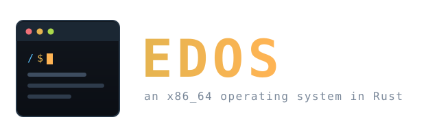

<p align="center">
  
</p>

<p align="center">
  A hobby operating system for x86_64, written in Rust.<br>
  SMP preemptive kernel, its own filesystem, a TCP/IP stack, USB, and a
  graphical window manager, with userspace programs built against a real
  Rust <code>std</code>.
</p>

<p align="center">
  <strong><a href="https://edos.edgl.dev">edos.edgl.dev</a></strong>
</p>

<p align="center">
  <a href="#quick-start">Quick start</a> &middot;
  <a href="#what-it-does">What it does</a> &middot;
  <a href="#building">Building</a> &middot;
  <a href="#running">Running</a> &middot;
  <a href="#documentation">Docs</a>
</p>

---

## What it does

EDOS boots on UEFI, brings up every core on the machine, and drops you into a
compositing desktop with a terminal. It brings its own scheduler, page cache,
filesystem, network stack, USB stack and window system.

| | |
|---|---|
| **Kernel** | SMP preemptive scheduler with per-CPU run queues and work stealing, demand paging, copy-on-write `fork`, TLB shootdown IPIs, futexes, signals, pipes, PTYs |
| **Storage** | EFS, a custom extent-based filesystem with a metadata journal, on AHCI with NCQ. Page cache, block cache, write-back with journal gating |
| **Network** | Ethernet, ARP, IPv4, ICMP, UDP, and a TCP state machine, plus DHCP and DNS. Works on real Intel I219/I218 NICs |
| **Graphics** | virtio-gpu driver, userspace compositor, window decorations, shared-memory buffers, hardware cursor |
| **USB** | xHCI with HID keyboard and mouse, and mass storage |
| **Audio** | Intel HDA with a `/dev/dsp` node |
| **Userspace** | 126 programs against a forked Rust `std`, including a shell with job control, globbing and scripting, a graphical editor with syntax colouring, a vi-like editor, a pager, `sed`, and the usual coreutils and network tools |

The kernel mounts the root filesystem and starts exactly one process,
`bin/edos-init`. That supervises the window manager, taskbar and terminal —
spawning them, reaping them and restarting them with backoff — so session
policy lives in userspace rather than in the kernel. It also starts `sshd`,
but only on a system that has an `/etc/sshd.conf` to configure it.

## Quick start

```bash
make all          # userspace, kernel, then a bootable ISO
make run          # boot it in QEMU with KVM
```

`make run` needs a local X or Wayland session. Over SSH, use:

```bash
make run-headless             # VNC for you, QMP for scripts
scripts/edos-vm shot out.png  # screenshot the guest
scripts/edos-vm type 'ls /bin' --enter
```

See [`doc/vm-control.md`](doc/vm-control.md) for driving the VM without a
display, including the two guest quirks that will otherwise waste your time.

## Building

You need `xorriso`, `sgdisk`, `mtools`, and QEMU, plus a Rust nightly for the
kernel.

Userspace is the awkward part: it links a **real `std`**, which means a custom
toolchain named `edos`.

```bash
git clone -b edos_std_v3 https://github.com/edg-l/rust.git
cd rust && ./x install
rustup toolchain link edos <install-prefix>
```

The fork is at [edg-l/rust](https://github.com/edg-l/rust/tree/edos_std_v3)
(branch `edos_std_v3`), and its runtime crate is
[edos_rt](https://github.com/edg-l/edos_rt). The target triple is
`x86_64-unknown-edos`. Without the `edos` toolchain, `make programs` and
`make all` fail, but `make -C kernel check` still works for kernel-only work.

| Target | What it does |
|---|---|
| `make all` | programs, kernel, bootable ISO |
| `make kernel` | kernel only |
| `make programs` | userspace only, into `filesystem/bin/` |
| `make check` | type-check the kernel |
| `make fmt` | format the kernel |
| `make test` | in-kernel scheduler test suite, headless |

## Running

| Target | What it does |
|---|---|
| `make run` | q35 + UEFI + KVM, 4 cores, virtio-gpu, e1000e, xHCI, HDA |
| `make run-headless` | no local display; VNC plus a QMP control socket |
| `make run-single` / `run-big` | 1 core / 16 cores |
| `make run-gdb` then `make gdb` | paused with a gdbserver, then attach `rust-gdb` |
| `make run-capture` | dump network traffic to `/tmp/edos.pcap` |
| `make run-storage` | attach a USB mass-storage disk |

The serial console is teed to `run_log.txt`, which is the first place to look
when something hangs. Resolve a panic address with:

```bash
addr2line -e kernel/target/x86_64-unknown-none/debug/edos-kernel -f 0xffffffff8009c422
```

### On real hardware

The ISO is hybrid and carries its own root filesystem, so it goes straight onto
a USB stick and boots to the desktop with nothing else attached:

```bash
sudo dd if=edos-x86_64.iso of=/dev/sdX bs=4M status=progress conv=fsync
```

The live root is a GPT image loaded as a Limine module and served from RAM. It
is writable, and it forgets everything on reboot. To keep what you write,
install to a disk from the live desktop:

```
/ $ edos-install /dev/sda
```

That partitions the target, formats an ESP and an EFS root, copies the live
system across, and writes Limine with the new root's GUID. Reboot without the
stick and the machine comes up on its own disk.

The e1000e driver works on real Intel I219/I218/I217 NICs, and DHCP will
configure networking if a server answers.

## Layout

```
kernel/          no_std kernel crate, target x86_64-unknown-none
  src/memory/    frame allocator, page tables, VMAs, COW, TLB shootdown
  src/thread/    scheduler, blocking primitives, pipes, PTYs, signals, futexes
  src/fs/        VFS, EFS, FAT32, memfs, devfs, procfs, page cache, journal
  src/drivers/   ahci, e1000e, xhci, hda, virtio-gpu, hpet, pci, msi
  src/net/       ethernet, ARP, IPv4, ICMP, UDP, TCP, DHCP, DNS
  src/syscalls/  SYSCALL/SYSRET entry and dispatch
  src/window/    window registry and input routing
programs/        cargo workspace, target x86_64-unknown-edos, links real std
libs/            shared between kernel and host tools
tools/           host-side: efs-mkfs, efs-fsck
doc/             specs, invariants, and post-mortems
```

## Documentation

Start here before changing anything load-bearing:

- [`doc/invariants/lock-order.md`](doc/invariants/lock-order.md) and
  [`doc/invariants/drop-contract.md`](doc/invariants/drop-contract.md), the two
  rules that break the system in non-obvious ways
- [`doc/efs.md`](doc/efs.md), the on-disk filesystem format, and
  [`doc/efs-fsck.md`](doc/efs-fsck.md) for the checker
- [`doc/vm-control.md`](doc/vm-control.md), driving the VM headless
- [`doc/bugs/`](doc/bugs/), post-mortems for hangs and races worth recognising
  if they come back
- [`doc/scripting.txt`](doc/scripting.txt), the shell scripting reference

## Releases

One file on the [releases page](https://github.com/edg-l/edos-v2/releases):
`edos-x86_64.iso`. Write it to a USB stick or hand it to QEMU, and it boots to
the desktop on its own. See [On real hardware](#on-real-hardware) for
installing to a disk, and [edos.edgl.dev/downloads](https://edos.edgl.dev/downloads/)
for the QEMU invocation.

## License

See [LICENSE](LICENSE).
